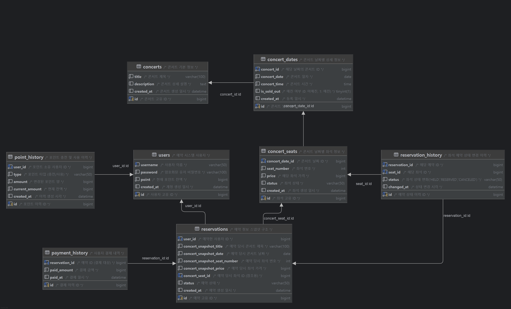

# 도메인 모델 & ERD
콘서트 예약 시스템의 핵심 도메인과 DB 테이블 구조를 정리한 문서입니다. 

## 테이블 목록
| 테이블명                  | 설명                                  |
| --------------------- |-------------------------------------|
| `users`               | 사용자, 포인트 잔액 포함                      |
| `point_history`       | 포인트 충전/사용 이력 기록 테이블                 |
| `concerts`            | 콘서트 기본 정보                           |
| `concert_dates`       | 콘서트 날짜별 공연 정보                       |
| `concert_seats`       | 날짜별 날짜별 좌석 정보(좌석 번호, 금액, 상태)        |
| `reservations`        | 예약 정보(스냅샷: 예약 고유 번호 및 결제 금액, 콘서트 정보) |
| `payment_history`     | 결제 이력                               |
| `reservation_history` | 좌석 예약 이력에 대한 정보                     |

## ERD


## 테이블별 상세 설명
### `users` - 사용자 정보
- 시스템에 가입한 사용자 정보 및 포인트 보유량
- **PK**: `id`
- **관계**
  - `point_history.user_id` (1:N)
  - `reservations.user_id` (1:N)

| 컬럼명         | 타입           | 설명        |
| ----------- | ------------ | --------- |
| id          | bigint       | 사용자 고유 ID |
| username    | varchar(50)  | 사용자명 |
| password    | varchar(100) | 암호화된 비밀번호 |
| point       | bigint       | 보유 포인트    |
| created_at | datetime     | 생성 일시     |


### `point_history` - 포인트 이력
- 포인트 충전/사용 내역
- **PK**: `id`
- **관계**
  - `FK`: `user_id` → `users.id`

| 컬럼명             | 타입           | 설명        |
| --------------- |--------------|-----------|
| id              | bigint       | 포인트 이력 ID |
| user_id        | bigint       | 사용자 ID    |
| type            | varchar(50) | 충전/사용 구분('CHARGE','USE') |
| amount          | bigint       | 변경된 양     |
| current_amount | bigint       | 현재 잔액     |
| created_at     | datetime     | 생성 일시     |

### `concerts` - 콘서트 기본 정보
- 콘서트 전체 정보
- **PK**: `id`
- **관계**
  - `concert_dates.concert_id` (1:N)

| 컬럼명         | 타입           | 설명     |
| ----------- | ------------ | ------ |
| id          | bigint       | 콘서트 ID |
| title       | varchar(100) | 제목     |
| description | text         | 상세 설명  |
| created_at | datetime     | 생성 일시  |


### `concert_dates` - 콘서트 날짜
- 날짜 단위 콘서트 일정
- **PK**: `id`
- **관계**
    - `FK`: `concert_id` → `concerts.id`
    - `concert_seats.concert_date_id` (1:N)

| 컬럼명          | 타입         | 설명                     |
|--------------|------------|------------------------|
| id           | bigint     | 콘서트 날짜 ID              |
| concert_id   | bigint     | 콘서트 ID                 |
| concert_date | date       | 콘서트 일자                 |
| concert_time | time       | 콘서트 시간                 |
| is_sold_out  | tinyint(1) | 매진 여부 (0: 미매진, 1: 매진) |
| created_at   | datetime   | 생성 일시                  |

### `concert_seats` - 콘서트 좌석
- **PK**: `id`
- **관계**
    - `FK`: `concert_date_id` → `concert_dates.id`
    - `reservations.concert_seat_id` (1:N)
    - `reservation_history.seat_id` (1:N)

| 컬럼명               | 타입            | 설명                                              |
| ----------------- |---------------|-------------------------------------------------|
| id                | bigint        | 좌석 ID (PK)                                      |
| concert_date_id | bigint        | 콘서트 날짜 ID (FK)                                  |
| seat_number      | int           | 좌석 번호                                           |
| price             | bigint        | 좌석 가격                                           |
| status            | varchar(50)  | 좌석 상태('AVAILABLE','HELD','RESERVED','CANCELED') |
| created_at       | datetime      | 생성 일시                                           |


### `reservations` - 예약 정보
- **PK**: `id`
- **관계**
    - `FK`: user_id → users.id
    - `FK`: concert_seat_id → concert_seats.id
    - `payment_history.reservation_id` (1:1)
    - `reservation_history.reservation_id` (1:N)

| 컬럼명                             | 타입           | 설명                                 |
| ------------------------------- |--------------|------------------------------------|
| id                              | bigint       | 예약 ID (PK)                         |
| user_id                        | bigint       | 사용자 ID (FK)                        |
| concert_snapshot_title        | varchar(100) | 예약 시점 콘서트 제목                       |
| concert_snapshot_date         | date         | 예약 시점 날짜                           |
| concert_snapshot_seat_number | int          | 예약 시점 좌석 번호                        |
| concert_snapshot_price        | bigint       | 예약 시점 가격                           |
| concert_seat_id               | bigint       | 원본 좌석 ID (FK, nullable)            |
| status                          | varchar(50) | 예약 상태('PENDING','PAID','CANCELED') |
| created_at                     | datetime     | 생성 일시                              |

### `payment_history` - 결제 내역
- **PK**: `id`
- **관계**
  - `FK`: `reservation_id → reservations.id`

| 컬럼명             | 타입       | 설명         |
| --------------- | -------- | ---------- |
| id              | bigint   | 결제 ID (PK) |
| reservation_id | bigint   | 예약 ID (FK) |
| paid_amount    | bigint   | 결제 금액      |
| paid_at        | datetime | 결제 시각      |

### `reservation_history` - 예약 상태 이력
- 좌석 상태(HELD/RESERVED/CANCELED) 변화 기록
- **PK**: `id`
- **관계**
  - `FK`: `reservation_id → reservations.id`
  - `FK`: `seat_id → concert_seats.id`

| 컬럼명             | 타입          | 설명                                  |
| --------------- |-------------|-------------------------------------|
| id              | bigint      | 이력 ID                               |
| reservation_id | bigint      | 예약 ID                               |
| seat_id        | bigint      | 좌석 ID                               |
| status          | varchar(50) | 상태 변화('HELD','RESERVED','CANCELED') |
| changed_at     | datetime    | 변경 시각                               |

## ERD 관계 요약
```text
[users]
├─ 1:N ──▶ [point_history]           # 사용자 → 포인트 이력
└─ 1:N ──▶ [reservations]            # 사용자 → 예약 정보

[concerts]
└─ 1:N ──▶ [concert_dates]           # 콘서트 → 날짜별 공연

[concert_dates]
└─ 1:N ──▶ [concert_seats]           # 날짜별 공연 → 좌석 정보

[concert_seats]
├─ 1:N ──▶ [reservations]            # 좌석 → 예약 (참조용)
└─ 1:N ──▶ [reservation_history]     # 좌석 → 상태 변경 이력

[reservations]
├─ 1:1 ──▶ [payment_history]         # 예약 → 결제 이력 (1회 결제)
└─ 1:N ──▶ [reservation_history]     # 예약 → 상태 변경 이력

[payment_history]
└─ 1:1 ◀── [reservations]            # 결제 → 예약

[reservation_history]
├─ N:1 ◀── [reservations]            # 이력 → 예약
└─ N:1 ◀── [concert_seats]           # 이력 → 좌석
```

[돌아가기](../README.md)