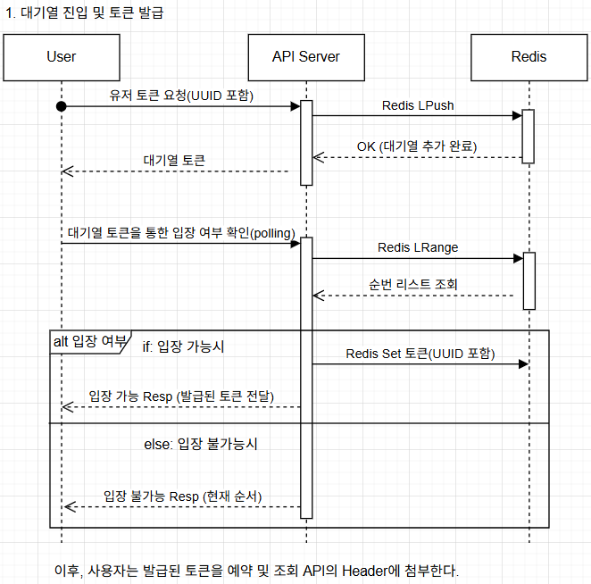
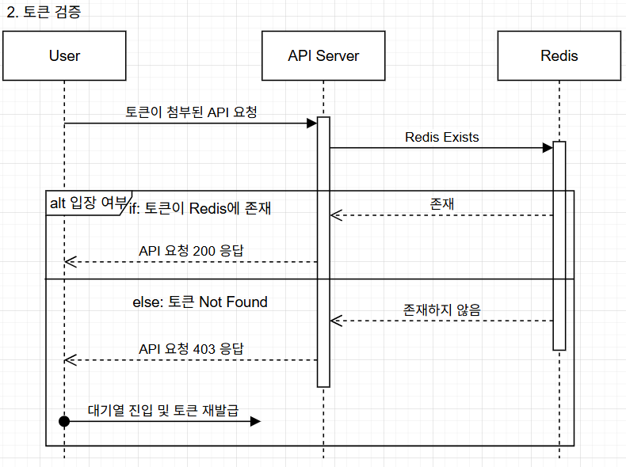
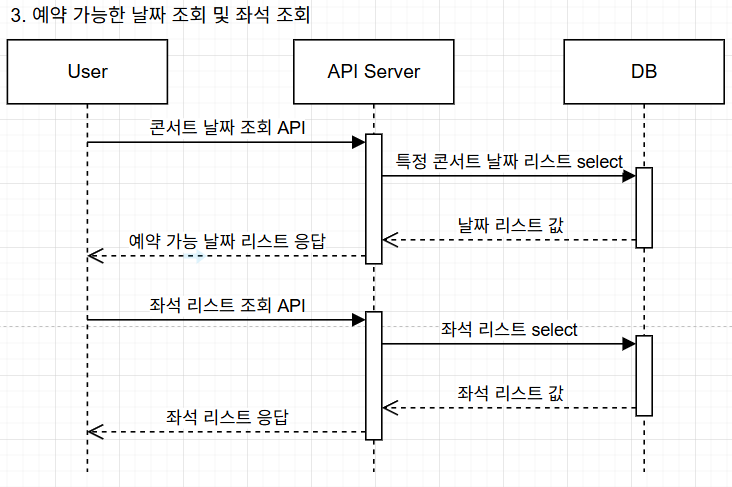
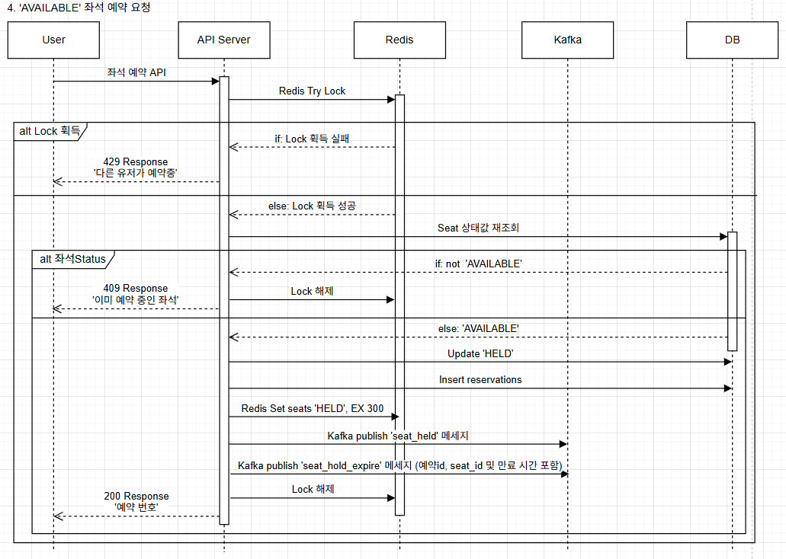
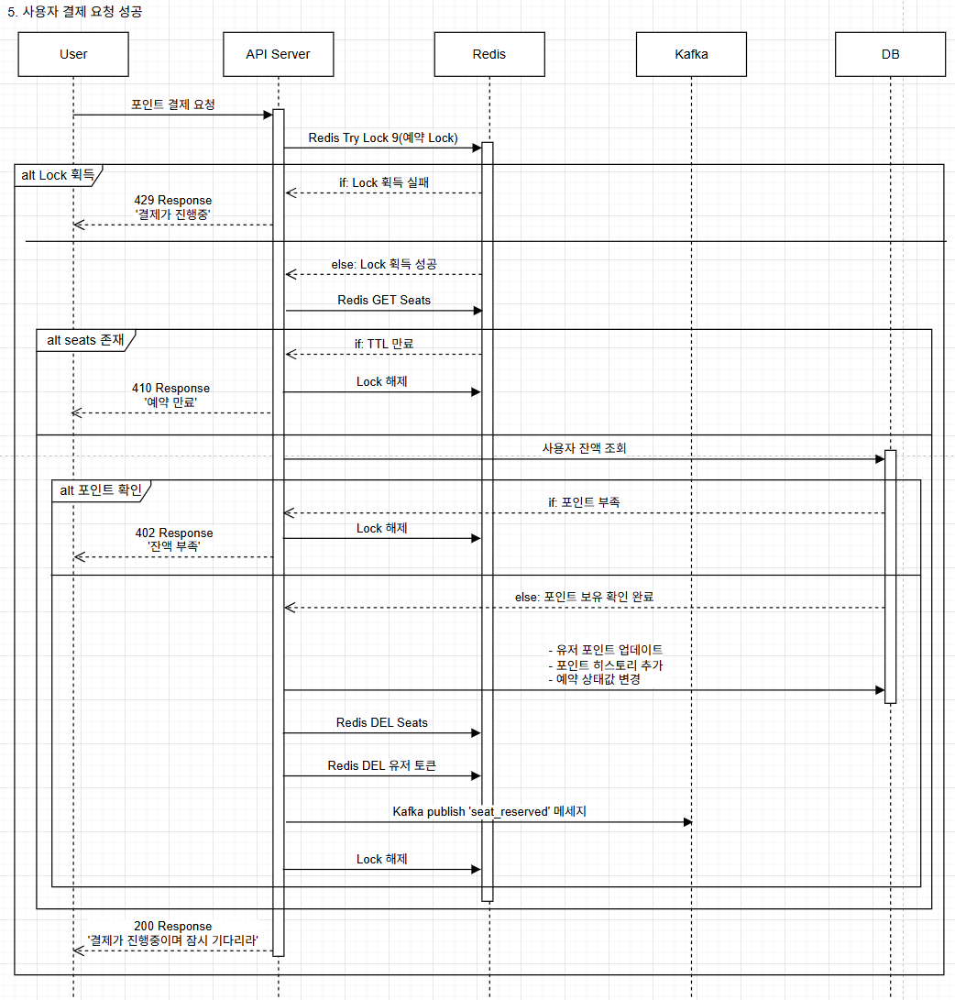
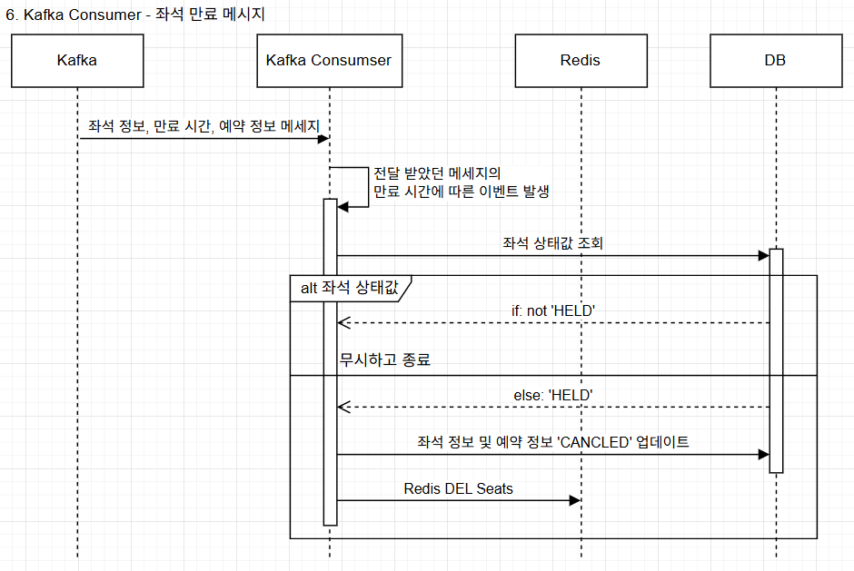
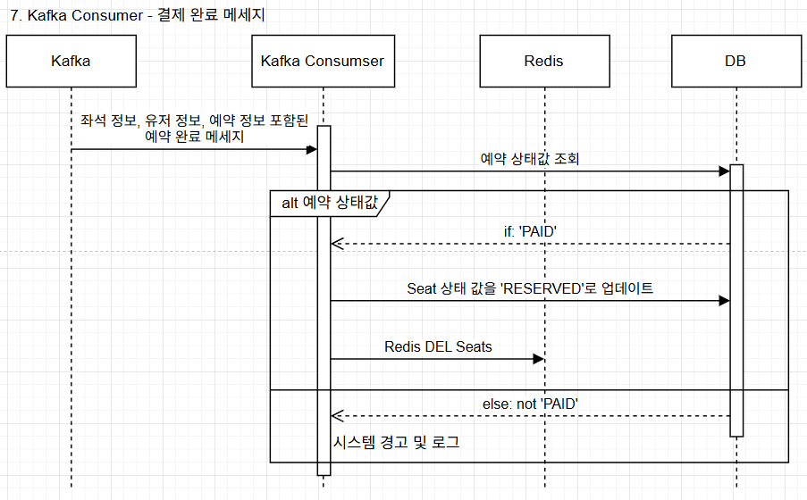

# 시퀀스 다이어그램
사용자의 포인트 충전 및 조회, 각종 히스토리를 조회하는 시퀀스 다이아그램은 제외하고 메인 시나리오에 대한 시퀀스 다이아그램에 대한 문서입니다.

## 1. 대기열 진입 및 토큰 발급
- 사용자의 Haeder에 토큰이 존재하지 않을 경우, 대기열 진입 및 토큰 발급 API를 호출한다.

## 2. 토큰 검증
- 모든 API 요청은 Haeder에 토큰을 첨부하며 해당 토큰을 검증하는 과정이다.
- 하기 API들은 모두 토큰 검증에서 통과한 이후의 시퀀스를 작성한다. 

## 3. 예약 가능한 날짜 조회 및 좌석 조회

## 4. 'AVAILABLE' 좌석 예약 요청
- HELD 처리 + TTL + Kafka 발행 + concert_seats 상태 업데이트 진행.

## 5. 사용자 결제 요청 및 성공 처리

## 6. Kafka Consumer - 좌석 만료 메시지

## 7. Kafka Consumer - 결제 완료

[돌아가기](../README.md)