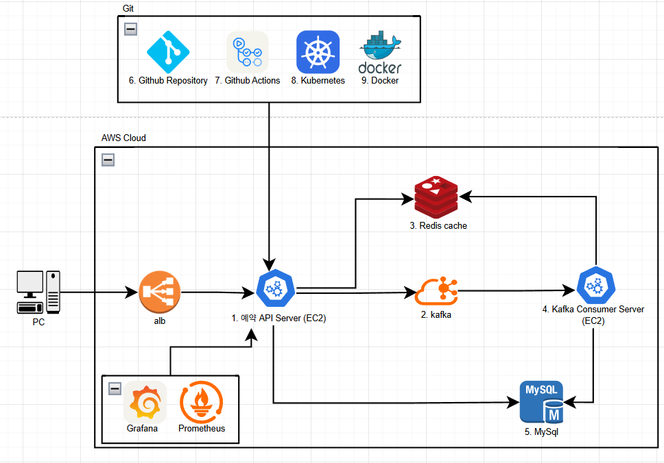

# 인프라 설계
## 인프라 구성도

### 1. `예약 API Server`
- 역할: 사용자의 예약 요청을 처리하는 메인 Spring Boot 어플리케이션
- 주요 기능
    - Kafka 비동기 메시지 전송(Kafka Producer)
    - 대기열 토큰 검증
  - 좌석 요청 처리 및 Redis TTL 설정(좌석 만료)
  - MySQL DB 접근 (예약, 포인트 충전/조회 등)

### 2. `Kafka`
- 역할: 예약/결제/TTL 만료 등의 이벤트 비동기 처리하기 위한 메세지 브로커

### 3. `Redis Cache`
- 역할: 대기열 토큰, TTL, 분산 락 처리 등

### 4. `Kafka Consumer Server`
- 역할: Kafka 메시지를 소비하는 별도의 서비스
- 주요 기능
  - Kafka 비동기 메시지 수신(Kafka Consumer)
  - 결제 완료 메시지 수신 → 좌석 상태 `RESERVED` 반영
  - 예약 생성 및 좌석 만료 메시지 수신시 해당 메시지 처리
  - 예약 내역 DB 기록 및 상태 동기화

### 5. `MYSQL` (Amazone RDS)
- 역할: 모든 주요 데이터 저장소 (유저, 포인트, 콘서트, 예약, 결제)

### 6. `GitHub Repository`
- 역할: 전체 소스코드 관리

### 7. `GitHub Actions`
- 역할: CI/CD 자동화
- 주요 기능
  - PR 시 테스트 및 빌드 확인
  - main 브랜치 merge 시 Docker 이미지 빌드 및 EC2 배포 스크립트 실행

### 8. `Kubernetes`
- 역할: 현재 구성에서는 EC2에 직접 배포하나, 이후 확장을 위한 옵션으로 표시

### 9. `Docker`
- 역할: 모든 앱을 컨테이너 단위로 패키징
- Docker Compose / Dockerfile 기반
- Local 환경 및 EC2 배포에 활용

[돌아가기](../README.md)